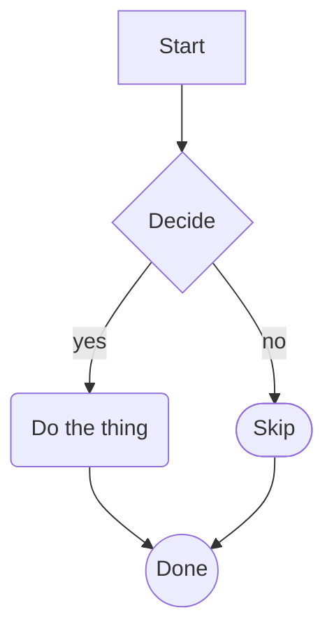

# MarkDownIt

A native Windows markdown viewer. No Electron, no .NET runtime, no external
dependencies shipped.

**Status:** early development.

## Build

CMake + Visual Studio 2022 Build Tools, Windows 10 SDK.

```
cmake -B build -S .
cmake --build build --config Release
```

## Usage

```
MarkDownIt.exe path\to\file.md
```

## Zoom

- Ctrl+MouseWheel: zoom in and out.
- Ctrl+=: zoom in.
- Ctrl+-: zoom out.
- Ctrl+0: reset zoom to 100%.

Zoom is a global view setting, not per-document state. The factor you
set carries over when you open another file, and the last factor used
is restored on the next launch. Supported range is 25% to 400%. Zoom
applies to the document content only; the ribbon and the scrollbar
keep their size.

## Mermaid flowcharts

MarkDownIt renders ` ```mermaid ` fenced blocks directly with Direct2D. There
is no headless browser, no JS runtime, no network. The block gets parsed,
laid out, and drawn like any other DOM element.

Supported today:

- Headers: `flowchart TD`, `flowchart LR`, `graph TD`, `graph LR`.
- Node shapes: rectangle `A[text]`, rounded `A(text)`, stadium `A([text])`,
  diamond `A{text}`, circle `A((text))`.
- Edges: solid `-->`, dotted `-.->`, thick `==>`, plain lines without arrows,
  and edge labels via `A -->|label| B`.
- Edge chains: `A --> B --> C` expands to two edges.
- Node reuse: the same id in a later statement points at the same node.

Example:

````

````

### Non-goals

Some things are out of scope, at least for now:

- No subgraphs, no styling directives, no click handlers, no classes.
- No sequence diagrams, class diagrams, state diagrams, or any other Mermaid
  diagram type. Only flowcharts.
- Pixel-exact parity with browser Mermaid is not a goal. The layout follows
  the same algorithm (a port of dagre) and the same default constants, but
  absolute coordinates drift because font metrics come from DirectWrite
  instead of the browser. Topology and relative placement match; pixel
  positions do not.

See `references/mermaid-dagre-port.md` for the layout pipeline and the
golden-oracle test pattern.

## License

MIT. See [LICENSE](LICENSE).
