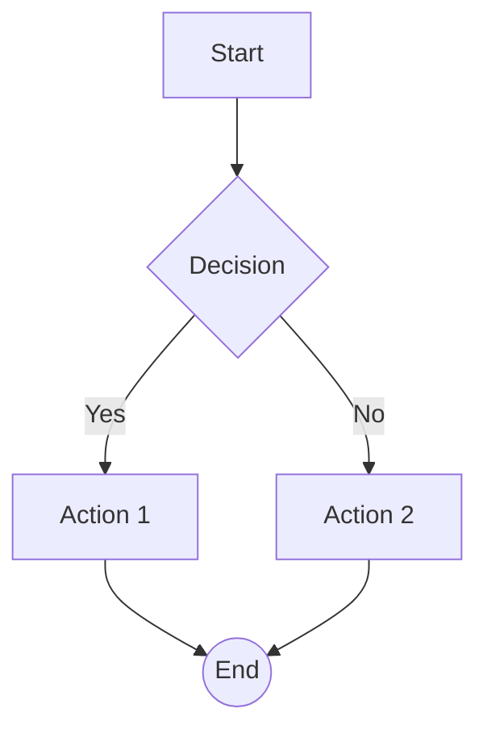
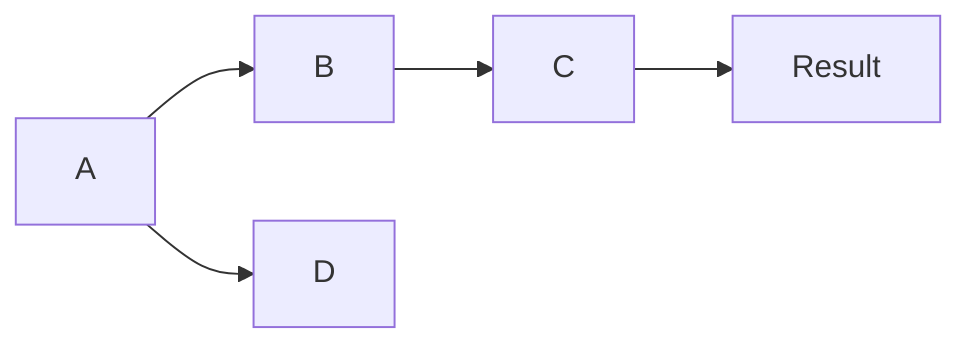
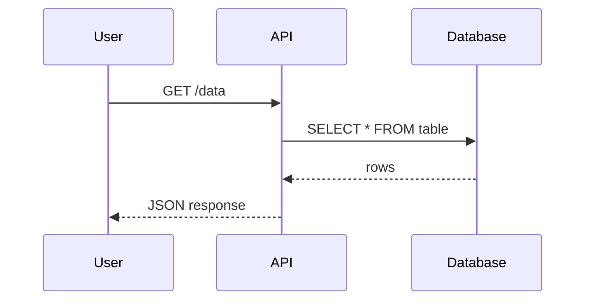
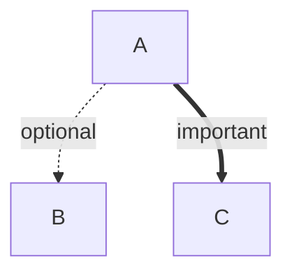
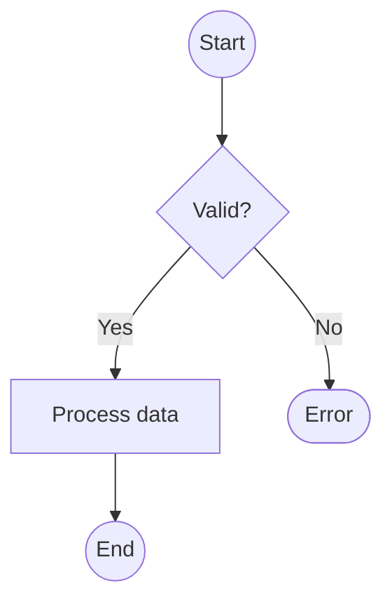
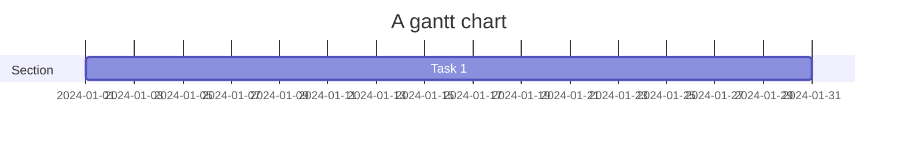

# Mermaid Diagram Test Document

## Flowchart Top-Down

## Flowchart Left-Right

## Sequence Diagram

## Dotted and Thick Edges

## Circle and Diamond Shapes

## Invalid Diagram (Falls Back to Code)

